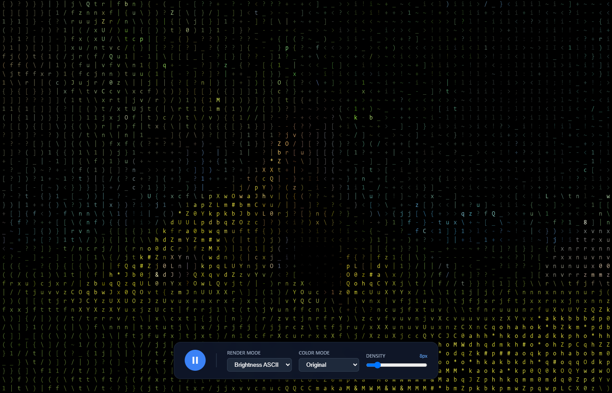

<div align="center">
  <h1>GlyphEngine</h1>
  <p><b>Real-time WebGPU Typography Renderer & Visual Reconstruction Engine</b></p>
  <p>
    
    
    
    
  </p>
</div>

<div align="center">
  
</div>

<br />

GlyphEngine is a WebGPU-based rendering engine that transforms uploaded video into real-time typography animations in your browser. Instead of standard pixels, it reconstructs visual content using moving glyphs (ASCII, Unicode blocks, edge characters) with real-time True Color reconstruction and customizable stylized themes.

---

## ✨ Features

- **⚡ Two-Pass WebGPU Pipeline**: Ultra-fast compute shader analysis and single-pass instanced quad rendering capable of pushing 130,000+ glyphs at 60 FPS.
- **🎨 True Color Reconstruction**: Accurate hue and skin-tone preservation via linear RGB averaging and coverage-corrected background/foreground blending.
- **📦 `.gef` v1 Native Format**: Export processed animations as compact `.gef` ZIP archives (`manifest.json` + 5-byte packed binary `frames.bin`) for instant replay without requiring source video.
- **🌐 `<glyph-player>` Web Component**: Embed your `.gef` creations natively into any website with a standalone script (~36 KB gzipped) featuring automatic WebGPU-to-thumbnail fallbacks for mobile and legacy browsers.
- **🎛️ Dynamic Styling & HUD**: Real-time density slider, color mode selection (True Color, Matrix, Amber, Terminal Green, Monochrome), edge detection modes, and a developer mode HUD (`Ctrl+Shift+D`).

---

## 🚀 Quick Start

### Installation & Development

```bash
git clone https://github.com/theonlyhussain/glyph-engine.git
cd glyph-engine
npm install
npm run dev
```

Open `http://localhost:5173` to view the application in your browser.

### Building for Production

```bash
npm run build
```

This builds both the React web application (`/dist`) and the standalone embed script (`/dist/embed.js`).

---

## 🧠 Architecture Overview

GlyphEngine follows a strict architectural boundary: `src/engine/` contains pure TypeScript/WGSL and never imports React or UI frameworks.

```
src/
├── engine/
│   ├── shaders/
│   │   ├── analyze.wgsl    # Compute shader: linear RGB sampling & luminance analysis
│   │   └── render.wgsl     # Render shader: instanced glyph atlas mapping & sRGB blending
│   ├── GefFormat.ts        # .gef ZIP serialization & 5-byte binary frame packing
│   ├── GlyphAtlas.ts       # Dynamic glyph texture atlas generation
│   ├── WebGPURenderer.ts   # Core WebGPU pipeline & GPUBuffer state management
│   └── GlyphEngine.ts      # Top-level engine controller & playback manager
├── embed.ts                # Standalone <glyph-player> Custom Element entrypoint
└── ui/                     # React control bar, settings drawer, and share modals
```

### Compute & Render Pipeline

1. **Analyze Pass (Compute Shader)**:
   - Samples the video frame using `importExternalTexture`.
   - Computes linear RGB color averages and luminance/edge magnitudes per grid cell.
   - Writes packed state into `cellDataBuffer` (Storage Buffer).

2. **Render Pass (Vertex & Fragment Shaders)**:
   - Draws instanced quads (`draw(6, instanceCount)`).
   - Maps vertex attributes to `GlyphAtlas` texture coordinates.
   - Evaluates sRGB color corrections, background/foreground coverage blending, and theme tints.

3. **Pre-Analyzed `.gef` Bypass Mode**:
   - When loading `.gef` files, the engine bypasses `analyze.wgsl` and video decoding entirely, streaming pre-analyzed frame buffers straight to the GPU render pass.

---

## 🔌 Web Component Embedding (`<glyph-player>`)

Embed your `.gef` renders directly on your portfolio or website:

```html
<!-- Include the standalone player script -->
<script type="module" src="https://glyph-engine.vercel.app/embed.js"></script>

<!-- Add the custom element -->
<glyph-player 
  src="https://your-file name.gef" 
  style="width: 100%; height: 500px; display: block;"
></glyph-player>
```

> **Fallback Handling:** If a visitor's browser or mobile device does not support WebGPU, `<glyph-player>` automatically extracts and displays the high-res static `thumbnail.png` stored within the `.gef` archive with an unobtrusive compatibility badge.

---

## 🎮 Keyboard & UI Shortcuts

* **Drag & Drop**: Drop any `MP4`, `WebM`, `MOV`, `AVI`, or `.gef` file onto the window.
* **Space**: Play / Pause animation.
* **Export Button**: Generate and download a `.gef` project package.
* **Embed Button (`</>`)**: Copy ready-to-use HTML embed code.
* **Ctrl + Shift + D**: Toggle Developer Mode HUD (FPS, glyph count, VRAM estimate).

----

## 📄 License

MIT License. See `LICENSE` for details.
